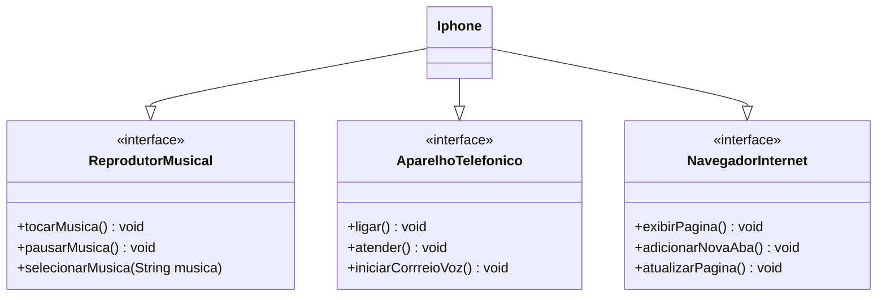

<h1 align="center">
 DIO - Trilha Java Básico
</h1>

<h2 align="center">
 POO Desafio
</h2>

<h2 align="center">
 <b><i>Modelagem e Diagramação de um Componente iPhone</i></b>
</h2>

	
	

## 💡 Sobre o projeto

Com base no vídeo de lançamento do iPhone de 2007, foi elaborado o diagrama das classes e interfaces utilizando a ferramenta UML on line https://mermaid.live/,  

Em seguida, foram implementadas as classes e interfaces no formato de arquivos `.java`.
 
 ## Diagrama UML (Mermaid)

## Descrição das Interfaces e Classes

### ReprodutorMusical

* Responsável por implementar a funcionalidade de reprodução de arquivos de áudio. Ela possui métodos como `tocarMusica()`, `pausarMusica()`, e `selecionarMusica()`.

### AparelhoTelefonico

* Responsável por implementar a funcionalidade de um telefone. Ela possui métodos como `ligar()`, `atender()`, e `iniciarCorreioVoz()`.

### NavegadorInternet

* Responsável por implementar a funcionalidade de um navegador web. Ela possui métodos como `exibirPagina()`, `adicionarNovaAba()`, e `atualizarPagina()`.

##  🔧 Tecnologias

  
## 🔗 Referências
- Videoaulas do Bootcamp na plataforma da DIO

## ✅ Feedback

Caso tenha algum feedback, entre em contato!

 

 Desenvolvido por Anderson Oaski Grampinha 

